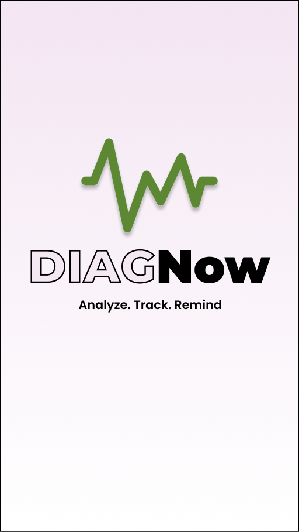
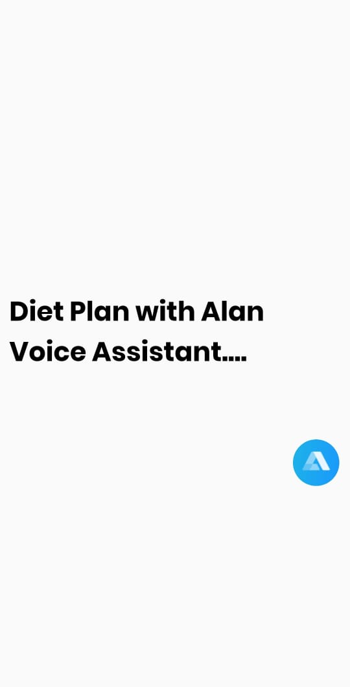

# DIAGNow
Application for Automated Medical Report Diagnosis, Medications trackment,  Medical Record  Storage &amp; Diet.
# KJSCE Hack 6.0
## Result: 1st Runner Up 🥈
### Team No.24 : O(1) 👨🏻‍💻
```Prajwal Jaiswal```

```Jaydeep Jethwa``` 

```Abhishek Mishra``` 

```Ravi Prasad``` 
##### Computer Engineering,
#### Thakur College of Engineering & Technology
<hr>

## DIAGNow

### Problem Statement:
* It is often difficult for patients to return to the doctors for a consultation because of several complications. 
Smart Medical Assistant
* As the world population increases, more people now live permanently which chronic medical conditions that need monitoring for the patient to stay healthy and live a longer life. 
* Several reports indicate that most of the population is unhealthy and  doesn’t follow a proper diet with adequate nutrients.

### Solution:

* An app that is one stop Solution to all the Problems listed, an app that provides various smart services like Automated Medical Report Diagnosis, Medications trackment, Medical Record Storage & Diet as mentioned in the Problem Statement 

* So, we are building DIAGNow, it is All in one app where we have services for Health related to:
Analysis of Medical Reports
  * E-Receipt 
  * Diet & Recipes Recommendation
  * Smart Voice Assistant


### App Interface:
<kbd>

</kbd>
<kbd>

</kbd>
<kbd>

</kbd>
<hr>

## Links:
http://diagnowcreate.netlify.com

http://diagnowaccess.netlify.com


